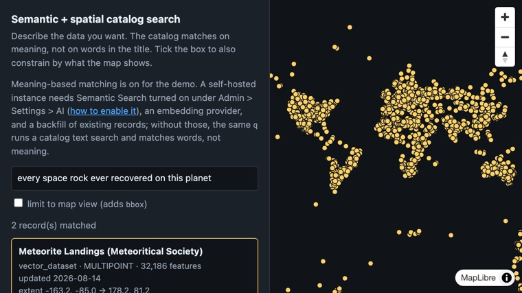
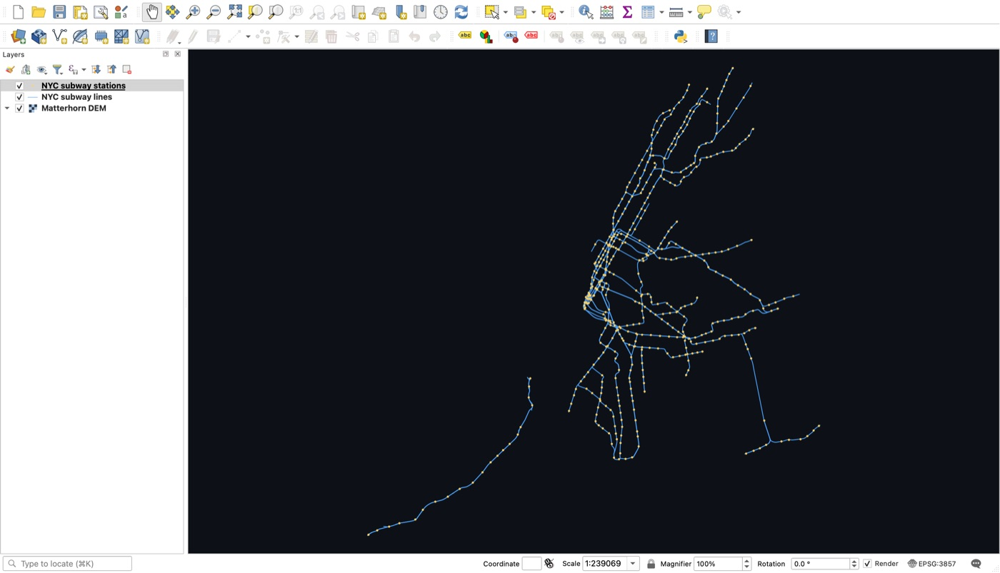
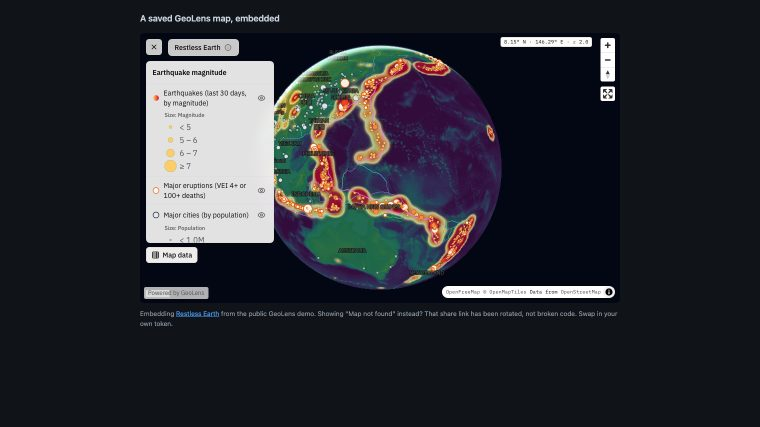

# GeoLens Examples

[](https://geolens-io.github.io/geolens-examples/)
[](https://github.com/geolens-io/geolens-examples/actions/workflows/verify.yml)
[](https://github.com/geolens-io/geolens)
[](LICENSE)

[GeoLens](https://github.com/geolens-io/geolens) is a self-hosted spatial data hub: catalog, search, maps, analysis, and open APIs over data that stays on your own infrastructure. This repo holds copy-paste integrations for the tools your stack already uses. Every browser, Python, and DuckDB example reads the public demo anonymously, so you clone, open, and see it run; one constant at the top points it at your own instance. The exception is [`cli/`](cli/), which publishes to a catalog and so runs against your own instance with a credential.

<p align="center">
  <a href="https://geolens-io.github.io/geolens-examples/search/catalog.html"></a>
  <a href="qgis/"></a>
  <a href="https://geolens-io.github.io/geolens-examples/embed/iframe.html"></a>
</p>
<p align="center"><em>Search the catalog by meaning, connect from desktop GIS, or embed a map, with the same self-hosted catalog and open APIs underneath.</em></p>

- **[Live gallery](https://geolens-io.github.io/geolens-examples/)**: every browser example running, arranged by what you are trying to do. Open one before you clone anything.
- **[Try GeoLens](https://demo.getgeolens.com/maps)**: the public demo these examples read. Its catalog and its saved maps open without an account.
- **[Main repository](https://github.com/geolens-io/geolens)**: GeoLens itself, with the install script, the docs, and the issue tracker.

If GeoLens is useful to you, [star it on GitHub](https://github.com/geolens-io/geolens). That is how most people find it.
If these examples save you an afternoon, star or watch [this repo](https://github.com/geolens-io/geolens-examples) too.

GeoLens serves OGC API Features and Records, STAC 1.0, XYZ vector tiles (MVT), and raster tiles ([API reference](https://docs.getgeolens.com/guides/api/ogc/)). These examples show those surfaces from the consumer's side.

## GeoLens in 10 minutes

The table below is arranged by tool; the numbered steps here trace the platform from an empty instance to a map someone else can use.

1. **Install.** `curl -fsSL https://getgeolens.com/install.sh | sh` starts the stack with Docker Compose; open `http://localhost:8080` about a minute later ([install guide](https://docs.getgeolens.com/guides/quickstart/install/)). The [public demo](https://demo.getgeolens.com) covers the read steps below without an install.
2. **Publish two sources.** Declare them in a manifest and run `geolens apply`. [`cli/`](cli/) holds a `geolens.yaml` with two Natural Earth layers and the GitHub Actions workflow that applies it ([CLI guide](https://docs.getgeolens.com/guides/cli/)).
3. **Find them by meaning.** [`search/catalog.html`](search/catalog.html) asks the catalog for a phrase rather than a title. On your own instance semantic search is off until an admin adds an embedding provider, turns it on under Admin > Settings > AI, and runs the embedding backfill ([search guide](https://docs.getgeolens.com/guides/user/search/)).
4. **Build a map.** Add layers from the catalog, style each one, set the viewport, save ([map builder guide](https://docs.getgeolens.com/guides/user/map-builder/)). The demo's [showcase maps](https://demo.getgeolens.com/maps) came in through the same maps API, by script rather than by hand.
5. **Analyze on the server.** The builder's Analysis panel runs buffer, intersect, dissolve and five more operations in PostGIS and writes the result back to the catalog as a new dataset; all but dissolve preview on the map first ([analysis guide](https://docs.getgeolens.com/guides/user/analysis/)). The demo answers anonymous analysis calls with 401, so there is no live example here; [`python/analyze.py`](python/analyze.py) does a comparable spatial join client-side.
6. **Publish or embed it.** A share link gives the map a stable `/m/<token>` URL, and `?embed=true` puts it in an iframe on a page that is not GeoLens: [`embed/iframe.html`](embed/iframe.html).
7. **Read it back from anywhere.** The same catalog answers QGIS over OGC API Features ([`qgis/`](qgis/)), the Python SDK ([`python/sdk-catalog.py`](python/sdk-catalog.py)), the TypeScript SDK ([`typescript/catalog-map.html`](typescript/catalog-map.html)), leafmap and GeoPandas in a notebook ([`leafmap/quickstart.ipynb`](leafmap/quickstart.ipynb)), and plain SQL in DuckDB ([`duckdb/query.py`](duckdb/query.py)).

## Examples

| Example | Tool | Demonstrates | Run it |
|---|---|---|---|
| [`maplibre/vector-tiles.html`](maplibre/vector-tiles.html) | MapLibre GL JS 5.x | Vector tiles (MVT) cut per request from PostGIS | [Live](https://geolens-io.github.io/geolens-examples/maplibre/vector-tiles.html) |
| [`maplibre/features.html`](maplibre/features.html) | MapLibre GL JS 5.x | GeoJSON features, click identify with no round-trip | [Live](https://geolens-io.github.io/geolens-examples/maplibre/features.html) |
| [`maplibre/features-viewport.html`](maplibre/features-viewport.html) | MapLibre GL JS 5.x | Features by viewport: `bbox`, `rel="next"` paging, cancellation, and the cap where vector tiles take over | [Live](https://geolens-io.github.io/geolens-examples/maplibre/features-viewport.html) |
| [`maplibre/imagery.html`](maplibre/imagery.html) | MapLibre GL JS 5.x | Raster tiles through a WebGL texture (needs CORS) | [Live](https://geolens-io.github.io/geolens-examples/maplibre/imagery.html) |
| [`maplibre/pmtiles.html`](maplibre/pmtiles.html) | MapLibre GL JS 5.x + pmtiles 4.5 | A PMTiles export as one committed static file: range reads where the host answers 206, no tile server either way | [Live](https://geolens-io.github.io/geolens-examples/maplibre/pmtiles.html) |
| [`arcgis-js/features.html`](arcgis-js/features.html) | ArcGIS Maps SDK for JavaScript 5.1 | `OGCFeatureLayer` against the OGC API landing page | [Live](https://geolens-io.github.io/geolens-examples/arcgis-js/features.html) |
| [`arcgis-js/imagery.html`](arcgis-js/imagery.html) | ArcGIS Maps SDK for JavaScript 5.1 | `WebTileLayer` with Esri's `{level}/{col}/{row}` names | [Live](https://geolens-io.github.io/geolens-examples/arcgis-js/imagery.html) |
| [`openlayers/features.html`](openlayers/features.html) | OpenLayers 10 | OGC API Features, CRS84 reprojected on read | [Live](https://geolens-io.github.io/geolens-examples/openlayers/features.html) |
| [`openlayers/imagery.html`](openlayers/imagery.html) | OpenLayers 10 | XYZ raster, and what `crossOrigin` costs you | [Live](https://geolens-io.github.io/geolens-examples/openlayers/imagery.html) |
| [`leaflet/features.html`](leaflet/features.html) | Leaflet 1.9 | GeoJSON features straight into `L.geoJSON` | [Live](https://geolens-io.github.io/geolens-examples/leaflet/features.html) |
| [`leaflet/imagery.html`](leaflet/imagery.html) | Leaflet 1.9 | Raster tiles as plain ``, so no CORS needed | [Live](https://geolens-io.github.io/geolens-examples/leaflet/imagery.html) |
| [`typescript/catalog-map.html`](typescript/catalog-map.html) | `@geolens/sdk` 1.16.1 + MapLibre | Catalog search, schema and freshness, then the tile link the collection advertises ([TypeScript SDK guide](https://docs.getgeolens.com/guides/sdk/typescript/)) | [Live](https://geolens-io.github.io/geolens-examples/typescript/catalog-map.html) |
| [`search/catalog.html`](search/catalog.html) | MapLibre GL JS 5.x + `fetch` | Semantic catalog search, narrowed to the map view, then drawn | [Live](https://geolens-io.github.io/geolens-examples/search/catalog.html) |
| [`embed/iframe.html`](embed/iframe.html) | No library | A saved GeoLens map in an iframe, styling and legend intact | [Live](https://geolens-io.github.io/geolens-examples/embed/iframe.html) |
| [`stac/browse.html`](stac/browse.html) | MapLibre GL JS 5.x | STAC item search over the map view, then the tile asset each item advertises | [Live](https://geolens-io.github.io/geolens-examples/stac/browse.html) |
| [`python/analyze.py`](python/analyze.py) | Python (single-file `uv run` script) | Features API → GeoPandas spatial join, metric-CRS analysis, styled plot | `uv run python/analyze.py` |
| [`python/sdk-catalog.py`](python/sdk-catalog.py) | `geolens` 1.16.1 (single-file `uv run` script) | SDK catalog search, schema semantics, a server-side CQL2 filter count, export into GeoPandas ([Python SDK guide](https://docs.getgeolens.com/guides/sdk/python/)) | `uv run python/sdk-catalog.py` |
| [`leafmap/quickstart.ipynb`](leafmap/quickstart.ipynb) | leafmap + GeoPandas (Jupyter notebook) | Catalog search, OGC API Features into GeoPandas, a CQL2 filter against the catalog, raster tiles baked by TiTiler | `uv run --with jupyterlab --with ipykernel --with pip jupyter lab leafmap/quickstart.ipynb` |
| [`mcp/`](mcp/) | Any MCP client via the GeoLens MCP server | Catalog search, schema, spatial queries, and tool chaining from an AI assistant ([MCP server guide](https://docs.getgeolens.com/guides/sdk/mcp/)) | `claude mcp add geolens -e GEOLENS_INSTANCE=https://demo.getgeolens.com -- uvx geolens-mcp@1.16.1` |
| [`qgis/`](qgis/) | QGIS 4.2 | OGC API Features + Records with CQL2, XYZ raster, tile-token auth | `https://demo.getgeolens.com/api/` |
| [`duckdb/query.py`](duckdb/query.py) | DuckDB 1.5 + `spatial` (single-file `uv run` script) | One SQL join across the GeoParquet export and the Features API, with column pruning over HTTP ranges | `uv run duckdb/query.py` |
| [`cli/`](cli/) | `geolens-cli` 1.16.1 | Catalog-as-code: offline `validate`, then `apply --dry-run` and `apply` against your instance | `uvx --from geolens-cli==1.16.1 geolens validate cli/geolens.yaml` |

Every browser row above is checked against the live demo by [`ci/verify-examples.mjs`](ci/verify-examples.mjs), which asserts the documented data loaded and the map painted; a 200 response alone does not pass. Where an example draws two layers of its own in fixed colours, it also asserts each one painted, by colour. The embedded map is the exception: it renders seven layers GeoLens styles server-side, so CI proves the frame loaded and its tiles flowed, and does not check each layer. The three `uv run` scripts run green with one command each, and each asserts its own answers rather than just finishing. [`leafmap/quickstart.ipynb`](leafmap/quickstart.ipynb) is checked the same way, one level up: [`leafmap/verify.py`](leafmap/verify.py) executes the actual notebook headlessly and fails on the first cell that raises.

MapLibre examples also work with Mapbox GL JS with minimal changes (both consume the same MVT and raster sources).

## Running the browser examples

Each browser example is one static HTML file with no build step: the library loads from a pinned CDN. Open the file directly in a browser, or serve the folder if your browser restricts `file://` pages:

```bash
python3 -m http.server 8000
# then visit http://localhost:8000/maplibre/vector-tiles.html
```

## Using your own GeoLens instance

Each example declares its target at the top:

```js
const GEOLENS = "https://demo.getgeolens.com";
```

Change it to your instance URL.

These examples need **GeoLens v1.13.0 or newer**. Raster tiles only started sending `Access-Control-Allow-Origin` in that release ([geolens#1464](https://github.com/geolens-io/geolens/issues/1464)), and without it the MapLibre and ArcGIS imagery examples draw an empty map while the server returns perfectly valid PNGs. The features and vector-tile examples reach further back: the anonymous CORS wildcard they depend on has been there since v1.4.7.

Dataset IDs and table names in these examples belong to the demo catalog. Against your own instance, list what's available at `/api/collections` and substitute your collection IDs. The demo gets reset from time to time, and a reset can change its dataset UUIDs, so treat the IDs hardcoded here as demo-specific rather than as part of any API.

CI replays every example against the live demo on every pull request, on each push to `main`, and once a week on a schedule, so an ID that stops resolving turns the build red instead of quietly leaving you with a blank map. Those IDs are named once in [`ci/fixtures.json`](ci/fixtures.json) and probed before the browser sweep runs, so a reset shows up as a red preflight naming the dataset that moved rather than as every example failing at once.

Anonymous cross-origin reads work with no setup: GeoLens answers the standards paths (`/api/collections`, `/api/stac`, conformance) with `Access-Control-Allow-Origin: *` as long as the request carries no credential. Send a credential and that wildcard is gone, so your page's origin has to be listed in the instance's `CORS_ALLOWED_ORIGINS`. A literal `*` there is rejected, since credentialed CORS requires explicit origins.

## Authenticating against your own instance

The demo is public, so none of these examples send a credential. On your own instance, pick the method your client can actually use:

| Client | Use |
|---|---|
| `fetch`, an SDK, Python, GDAL, ArcGIS request interceptors | `X-Api-Key: <key>` header, or `Authorization: Bearer <jwt>` |
| A static XYZ/MVT URL template that cannot set headers | a signed tile token, scoped to one dataset and short-lived |
| Public data, including everything in the demo | nothing |

The header and the `?api_key=` query parameter carry the same key and grant the same access. Only the transport differs. The order GeoLens checks credentials in is documented in the [authentication guide](https://docs.getgeolens.com/guides/api/auth/) and implemented by `_resolve_api_key` and `get_optional_user` in `backend/app/modules/auth/dependencies.py`.

Prefer the header. A key in a URL ends up in browser history, server access logs, every proxy log along the way, analytics, screenshots, and anything anyone copy-pastes, which is why GeoLens deprecated the query lane in geolens#821 and kept it only for clients that genuinely cannot set a header. Desktop GIS consuming an XYZ template is the case it exists for.

Do not put a long-lived API key in a static HTML file, and do not commit one. Anyone who reads the page source has your key with all of your access until someone notices and revokes it.

### Signed tile tokens

`GET /api/tiles/token/<dataset_id>/` mints a token for a single dataset (the [tile endpoints reference](https://docs.getgeolens.com/guides/api/ogc/#tile-endpoints) covers what a tile token is and why it is not an API key). A vector dataset returns `sig`, `exp`, and `scope` to append to the tile template; a raster dataset returns the whole `tile_url` with those already in the query string.

```bash
curl https://demo.getgeolens.com/api/tiles/token/6f03bafa-34b3-4902-9351-40ce09a8181f/
# {"kind":"raster",
#  "tile_url":"/raster-tiles/6f03.../tiles/{z}/{x}/{y}.png?sig=47a4...&exp=1786838400&scope=6f03...&v=1",
#  "expires_in":530, ...}
```

`exp` is always a 15-minute boundary, usually the next one. When that boundary is under a minute away the mint skips to the following one instead, so a fresh token carries anywhere from 60 seconds to just under 16 minutes. Read `expires_in` off the response rather than assuming a fixed TTL. `POST /api/tiles/tokens/` mints up to 50 in one call for a multi-layer map.

Two properties decide whether this fits your page.

Minting is itself authorized. A public, published dataset hands a token to anyone, which is why the `curl` above works signed out. A private one answers an anonymous mint with 401, so a page holding no credential cannot mint its own token and something server-side has to hold the key and pass tokens down. A scoped token does not remove the need for a credential. It keeps the credential out of the browser.

Tokens expire and clients do not renew them on their own. MapLibre keeps requesting whatever template you handed it, so a page that stays open has to re-mint and reset the source URL before `exp` passes.

`X-Embed-Token` is a different mechanism and not a substitute here. Embed tokens are minted per *map* by an authenticated owner, and the tile routes read them from the header only, so one cannot ride along in a URL template.

## OGC API Features or vector tiles

The three `features.html` examples fetch every feature once with `?limit=2000` and hold the whole result in browser memory. That works for the demo's subway layers (496 stations, 29 lines). It is the wrong shape for a parcel, road, or building layer, where the same code silently renders one truncated page.

Use [OGC API Features](https://docs.getgeolens.com/guides/api/ogc/#ogc-api---features) when the result is small or bounded, when you need attributes on the client, when you load by viewport or filter instead of all at once, or when the page interacts with individual features.

Use vector tiles when the dataset is large, when users pan and zoom across all of it, when not every feature needs to reach the browser, and when rendering performance matters more than holding the full attribute table. `maplibre/vector-tiles.html` shows that path: the server cuts MVT per tile and the client holds only what is on screen.

Every items response says which case you are in:

```bash
curl "https://demo.getgeolens.com/api/collections/724bf894-dc1a-418c-abc6-555798c44d7c/items?limit=2" \
  | jq '{numberMatched, numberReturned}'
# { "numberMatched": 496, "numberReturned": 2 }
```

`numberMatched` is what the query found; `numberReturned` is what this page contains. When they differ you are holding a partial result, which is the signal that a one-shot fetch has truncated your data.

It is not the signal that another page exists. Walk the stations collection at `limit=400` and the last page returns 96 of 496 matched, counts differing, with no `next` link on it. The `rel="next"` link is the authority: follow it until it stops appearing, and read the counts as a diagnostic rather than a loop condition. Paging is keyset-based (`after_gid=`), so rows do not shift under a reader mid-scan. `python/analyze.py` does exactly that in a few lines. [`maplibre/features-viewport.html`](maplibre/features-viewport.html) is the same guidance in a browser: it requests `bbox=<view>` on every settled view, follows `next`, cancels the walk a pan made stale, and stops at a per-view cap that says on screen when to switch to vector tiles.

## License

[MIT](LICENSE). The examples are intentionally small; copy them into your project freely.
