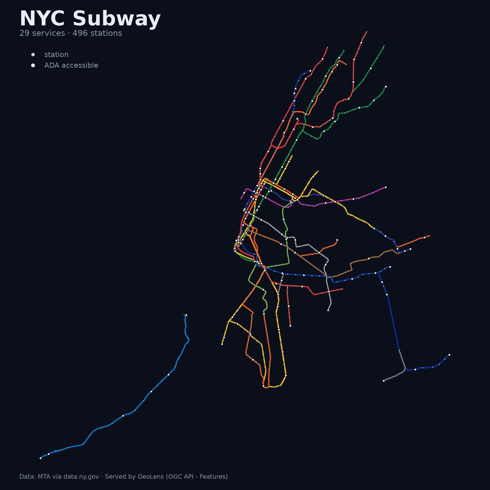

# Python: read a GeoLens catalog

Two single-file scripts, two ways in. Both run with one command and nothing
installed, because their dependencies live in a
[PEP 723](https://peps.python.org/pep-0723/) header that uv reads:

| script | route | use it when |
| --- | --- | --- |
| [`analyze.py`](analyze.py) | OGC API - Features over plain HTTP | the client has to be a standards client, or the language is not Python |
| [`sdk-catalog.py`](sdk-catalog.py) | the [`geolens`](https://pypi.org/project/geolens/) package ([Python SDK guide](https://docs.getgeolens.com/guides/sdk/python/)) | the language *is* Python and you want typed models |

The docs weigh those routes against the CLI and the MCP server under
[CLI vs SDK vs MCP vs raw API](https://docs.getgeolens.com/guides/sdk/#cli-vs-sdk-vs-mcp-vs-raw-api).

```bash
uv run analyze.py
uv run sdk-catalog.py
```

## analyze.py: measure a network with GeoPandas

Reads two collections from the GeoLens demo, measures the NYC subway in a metric
CRS, joins stations to service lines spatially, and renders `subway.png`.



```
Reading https://demo.getgeolens.com ...

                          NYC SUBWAY
--------------------------------------------------------------
  services                    29
  stations                   496
  line geometry            730.9 km   (29 service geometries summed)
  after dissolve           562.1 km   (coincident parts merged)
  measured in         EPSG:32618

  ADA accessible             162   (33% of stations)
  partly accessible            9

  stations by borough
    Brooklyn            169   ############################
    Manhattan           153   ##########################
    Queens               83   ##############
    Bronx                70   ############
    Staten Island        21   ####

  longest services
                 km  parts  stops  stops/km  name
    A          56.5      6     74      1.31  8 Avenue Express
    SIR        54.0    133     21      0.39  Staten Island Railway
    F          44.0      1     59      1.34  6 Avenue Local
    D          41.6      2     58      1.39  6 Avenue Express
    2          41.0      2     73      1.78  7 Avenue Express

  SIR carries 133 parts against a median of 2: it is
  digitized track by track while the lettered services are single
  centerlines. Two conventions in one column, so 'km' is the length
  of the drawn geometry, not the length of the route.
--------------------------------------------------------------
  wrote subway.png
```

That last note matters as much as the map. The numbers are real, so they carry the
quirks of the source data, and the script prints the evidence for its own caveat
instead of asking you to trust a tidy figure.

Point it at your own instance with arguments, or `GEOLENS_INSTANCE` (the site root;
the script adds `/api`, and the CLI and MCP server read the same variable with or
without that suffix):

```bash
uv run analyze.py https://geolens.example.com
uv run analyze.py https://geolens.example.com <lines-id> <stations-id>
```

### What it shows

**The items endpoint returns plain GeoJSON.** `GET /api/collections/{id}/items`
hands back a `FeatureCollection`, so `gpd.GeoDataFrame.from_features()` is the whole
adapter. Collection ids are dataset UUIDs; list them at `GET /api/collections`.

**Paging follows the `next` link, and does not trust it.** `limit=2000` happens to
cover both demo collections in one request, but the script follows `rel=next`
anyway. GeoLens pages by keyset (`after_gid=...`), not offset, so rows never shift
underneath a reader mid-scan, and it drops the `next` link on the last page so the
loop ends on its own. A `next` that pointed back at a page already read would spin
forever instead, so the loop keeps the URLs it has visited and raises on the second
sighting. Fed a self-referential link by a stub server, the unguarded version made
9,436 requests in four seconds and was still going; the guarded one stops after one.

**A response that is not a FeatureCollection says so.** `payload["features"]` on a
body without that key is a bare `KeyError` several frames from the cause. The script
checks first and names the URL and the keys it did get.

**Transient failures are retried, wrong requests are not.** The demo is one shared
machine on the public internet, and it occasionally answers 502 or times out with
nothing wrong at either end. Those get three attempts with a widening gap. A 4xx
gets none: retrying a bad request only asks the same wrong question again.

**Private datasets take an API key in a header.** Set `GEOLENS_API_KEY` and the
script sends `X-Api-Key`. GeoLens still accepts `?api_key=` in the query string, but
that lane is deprecated, because a credential in a URL lands in access logs and in
every proxy log along the way. It survives only for clients that cannot set headers,
such as XYZ tile URLs pasted into desktop GIS. A *wrong* key returns 401 even for a
public dataset, so an unset variable is safer than a stale one.

**Measurements happen in a projected CRS.** Lengths taken on EPSG:4326 are in
degrees and mean nothing. The script reprojects to UTM 18N once, then everything
downstream is metres.

## sdk-catalog.py: find a dataset, then take a slice of it

Asks the catalog a plain-language question, reads the column schema GeoLens
inferred for whatever comes back, counts a CQL2-filtered slice through the OGC
items route, and pulls the same slice into GeoPandas through the export route.
It takes four SDK calls and never assembles a URL. Each call is the
`sync_detailed` form, so the status code arrives with the parsed body; the
[Python SDK guide](https://docs.getgeolens.com/guides/sdk/python/#first-call)
covers the `sync`, `sync_detailed` and `asyncio` variants.

```
Reading https://demo.getgeolens.com ...

                       GEOLENS CATALOG
--------------------------------------------------------------
  asked for           'space rocks that fell to earth'
  matched                      1   record

  Meteorite Landings (Meteoritical Society)
    id                6030c57b-ce37-4198-aa1e-be78e0950f53
    features              32,186   MULTIPOINT
    license           NASA open data (public domain)

  columns as GeoLens read them
    name         character varying  label
    recclass     character varying  categorical
    mass_kg      double precision   measure       in kilograms
    year         integer            temporal
    fall         character varying  categorical
    geom         MULTIPOINT         geometry

  filter              mass_kg > 1000   (evaluated in PostGIS, both lanes)
  numberMatched               51   items route, filter= as CQL2
  downloaded                  51   of 32,186 features, 11.1 KB   export route, where= as SQL

  heaviest recoveries
      tonnes  year  name                      class
        60.0  1920  Hoba                      Iron, IVB
        58.2  1818  Cape York                 Iron, IIIAB
        50.0  1575  Campo del Cielo           Iron, IAB-MG
        30.0  1891  Canyon Diablo             Iron, IAB-MG
        28.0  1898  Armanty                   Iron, IIIE
        26.0  1836  Gibeon                    Iron, IVA
        24.3  1852  Chupaderos                Iron, IIIAB
        24.0  1911  Mundrabilla               Iron, IAB-ung

  489 tonnes across 51 recoveries, of which 5 were
  watched coming down. The rest were found later, which is why the
  map of meteorite finds is really a map of where people look.
--------------------------------------------------------------
```

### What it shows

**Search matches meaning, not words.** `space rocks that fell to earth` finds
*Meteorite Landings* even though none of those five words is in the title. GeoLens
embeds each record's text at ingest and searches the vectors, so the query is a
description of the data rather than a guess at its filename.

**The catalog knows what its columns are.** `list_attributes` returns more than
names and types. `semantic_role` is the profiler's read on what each column is for
(label, measure, temporal, categorical, geometry), and `units` is what it found the
numbers to be in. Reading that is what tells you the filter should be on `mass_kg`,
and that the values are kilograms rather than grams.

**The filter runs in PostGIS, on two routes.** `where="mass_kg > 1000"` is SQL
against the dataset's own columns, evaluated server-side by the export route. The
51 rows that match arrive as 11 KB; the same export without the filter is 6.7 MB
and 32,186 rows. Pulling a whole dataset down to throw most of it away is the
usual way this goes wrong, and one argument avoids it. From GeoLens 1.16.0 the
OGC items route evaluates the same text as CQL2 (`filter=`, with `filter-lang`
defaulting to `cql2-text`), so the script counts the slice there first with
`limit=1` and checks that `numberMatched` agrees with what the export handed
over. `format_` also takes `gpkg`, `parquet`, `shp`, `csv`, `fgb` and `pmtiles`.

String comparisons are the one gap: the identifier check that keeps a `where` clause
honest reads quoted literals as column names, so `fall = 'Fell'` comes back
`400 Unknown column: Fell`. Filter on numbers server-side, on strings in pandas.

**Errors arrive typed.** A rejected filter parses into a `ProblemDetail` (RFC 9457),
so the reason is `response.parsed.detail`, an attribute rather than a blob of JSON
you decode by hand at the call site.

**An unrecognised API key is refused, not ignored.** Set `GEOLENS_API_KEY` and the
SDK sends `X-API-Key`; it has no way at all to put a key in the query string. A key
GeoLens cannot resolve answers 401 on all four of these endpoints, so a stale key
stops the script instead of quietly handing it the public subset. Sending no key is
anonymous and still reads public data. Measured against the demo (v1.14.0) on
2026-08-18. Instances older than v1.14.0 discard the bad key here and answer 200, so
there a private dataset can seem to have vanished when the key is the problem.

## ogr2ogr one-liners

Verified against the live demo with GDAL 3.13.0.

Pull a collection straight from the items URL into a GeoPackage. The GeoJSON driver
reads the URL directly, no `/vsicurl/` prefix:

```bash
ogr2ogr -f GPKG stations.gpkg \
  "https://demo.getgeolens.com/api/collections/724bf894-dc1a-418c-abc6-555798c44d7c/items?limit=2000" \
  -nln stations
```

```
$ ogrinfo -so stations.gpkg stations
Layer name: stations
Geometry: Multi Point
Feature Count: 496
Extent: (-74.251961, 40.512764) - (-73.755405, 40.903125)
ada: Integer (0.0)
borough: String (0.0)
division: String (0.0)
stop_name: String (0.0)
structure: String (0.0)
daytime_routes: String (0.0)
```

The per-dataset export endpoint serves whole datasets in other formats. GeoPackage
needs no conversion at all:

```bash
curl -o stations.gpkg \
  "https://demo.getgeolens.com/api/datasets/724bf894-dc1a-418c-abc6-555798c44d7c/export?format=gpkg"
```

For the other formats (`geojson`, `parquet`, `shp`, `csv`), convert locally:

```bash
curl -o lines.geojson \
  "https://demo.getgeolens.com/api/datasets/de602fbe-8b30-4755-924f-c9e7fd9613b6/export?format=geojson"
ogr2ogr -f GPKG lines.gpkg lines.geojson -nln subway_lines   # Feature Count: 29
```

You can also read the export endpoint in place, from GeoLens v1.14.0 on. `/vsicurl/`
opens with a HEAD request to negotiate byte ranges; that route used to answer HEAD
with 405 and GDAL sat there waiting. It now answers 200 with `Accept-Ranges: bytes`
and serves ranges as 206, so this opens in about two seconds:

```bash
ogrinfo -so "/vsicurl/https://demo.getgeolens.com/api/datasets/724bf894-dc1a-418c-abc6-555798c44d7c/export?format=gpkg"
```

GDAL warns that the URL carries no `.gpkg` extension, then opens it anyway. Against
an instance older than v1.14.0, download first. A plain GET of the geojson URL above
returns 10 MB in about 2.5 seconds.

For a private dataset, pass the key as a header:

```bash
ogr2ogr --config GDAL_HTTP_HEADERS "X-Api-Key: $GEOLENS_API_KEY" \
  -f GPKG stations.gpkg \
  "https://demo.getgeolens.com/api/collections/{id}/items?limit=2000"
```

Confirmed that GDAL transmits the header, using a deliberately invalid key: the
request came back 401 rather than succeeding anonymously. The authenticated path
itself is untested here, since the demo datasets are public and need no key.

## Pinned versions

`analyze.py` pins `geopandas==1.1.4`, `httpx==0.28.1`, `matplotlib==3.11.1`;
`sdk-catalog.py` pins `geolens==1.16.1` and `geopandas==1.1.4`. Those were the
current releases on 2026-08-28, and `sdk-catalog.py` was re-run against the
live demo (serving 1.16.1) on that date.
`requires-python = ">=3.11"` comes from matplotlib 3.11, the strictest
floor of the set.

Direct pins are not a lockfile. The transitive stack (shapely, pyproj, pandas,
numpy, attrs) floats, so two runs a month apart resolve different builds
underneath. If you need the exact tree back, `uv lock --script analyze.py` writes a
universal `analyze.py.lock` that `uv run` picks up on its own. Neither lock is
committed here: at 216 KB it is twenty times the script it locks, and these examples
are meant to stay one readable file each.

Data: MTA via [data.ny.gov](https://data.ny.gov) and the Meteoritical Society via
NASA Open Data, served by the GeoLens demo.
