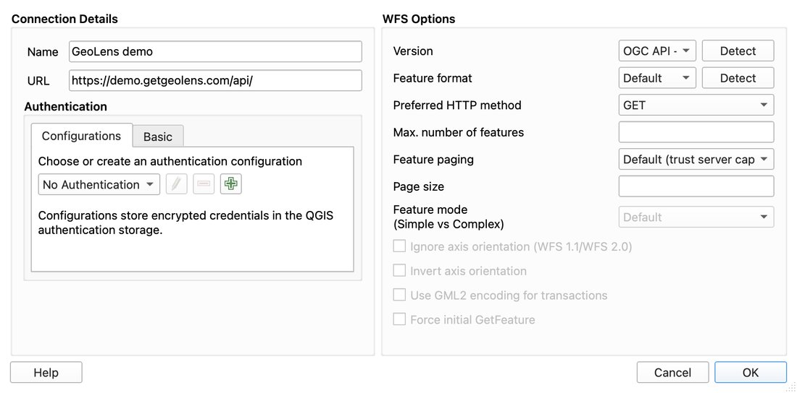
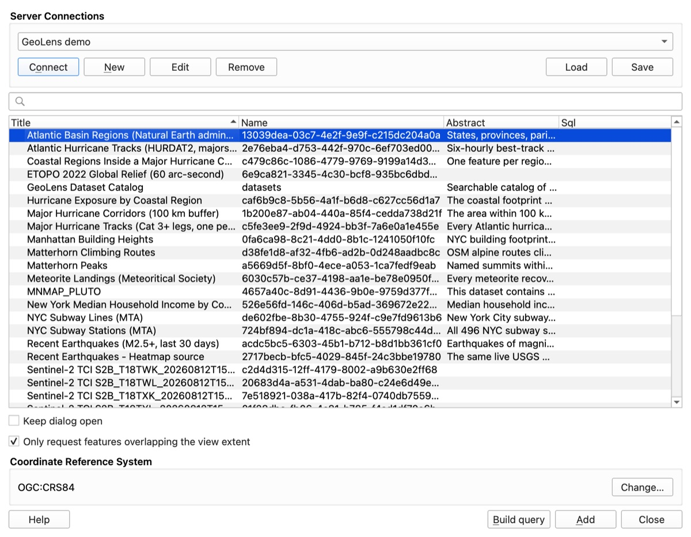

# QGIS: connect a desktop GIS to GeoLens

GeoLens speaks OGC API - Features, OGC API - Records, XYZ raster and vector tiles, and QGIS
reads all of those without a plugin. This walkthrough adds the public demo to QGIS the way an
analyst would: connect, find data in the catalog, add layers, then point the same steps at a
private instance. Everything below runs anonymously.

Verified against QGIS 4.2.1 (Belém do Pará) on macOS. The screenshots are QGIS 4.2.1 itself,
opened on a clean profile with the project below and driven by a startup script rather than a
mouse. The provider behaviour below (which URLs QGIS requests, what it does with a filter, whether
a header reaches the server) was measured in separate PyQGIS sessions against the demo.
[`verify.py`](verify.py) is narrower: it opens the same three layers with QGIS's own providers,
headless, and asserts they load, count right and draw.


The shortcut: open [`geolens-demo.qgz`](geolens-demo.qgz). It holds the three layers below,
styled, with the map on New York. Read on for how they got there.

## 1. Connect: OGC API - Features

See [OGC API - Features](https://docs.getgeolens.com/guides/api/ogc/#ogc-api---features) for the
endpoint reference; the mechanics below are QGIS's own.

Layer ▸ Add Layer ▸ Add WFS / OGC API - Features Layer… opens the Data Source Manager on the
*WFS / OGC API - Features* page. Click **New**, and in *Create a New WFS Connection* fill in:

| Field | Value |
|---|---|
| Name | `GeoLens demo` |
| URL | `https://demo.getgeolens.com/api/` |
| Version | `OGC API - Features` |



Leave the rest alone and press OK. Keep the trailing slash on the URL. GeoLens answers a bare
`/api` with a redirect to a port QGIS cannot reach, so instead of a collection list you get an
error box. QGIS's own tooltip on the URL box warns that some OGC API servers need the slash; this
is one of them. `Version` can stay on `Maximum` if you prefer: QGIS then tries a WFS
GetCapabilities first, fails, and falls back to the landing page. Picking `OGC API - Features`
skips the failed probe.

Press **Connect**. The table fills with every collection the demo publishes, thirty at the time
of writing, titled the way the catalog titles them.


 Select *NYC Subway Stations (MTA)* and
*NYC Subway Lines (MTA)*, and press **Add**. They land in the project as `MultiPoint` and
`MultiLineString` layers in `OGC:CRS84`, and QGIS reprojects them into whatever the project CRS is.

Two things on this page matter for bigger layers than the subway:

- **Only request features overlapping the view extent** is checked by default. With it on, QGIS
  asks for `items?bbox=<map extent>&limit=...` and re-asks as you pan, so a parcel layer arrives
  a screenful at a time. Uncheck it for a layer you want whole; the subway is 496 points and 29
  lines, so either way is fine.
- QGIS pages through a collection by following the `next` links the server sends. For the
  stations that is `items?limit=100`, then `limit=100&after_gid=100`, and so on to 496. You can
  raise the page size in the connection dialog (*Page size*, under *WFS Options*), and cap a layer
  with *Max. number of features*.

## 2. Find datasets: the catalog is a layer too

In that same table is *GeoLens Dataset Catalog*, name `datasets`. That is the OGC API - Records
collection: one record per dataset, geometry the dataset's footprint, attributes
`title`, `description`, `keywords`, `geometry_type`, `feature_count`, `source_organization`,
`license`, `updated`, quality scores, and the download links each dataset offers. Add it like
any other collection and open its attribute table, and you have the catalog in QGIS: sort by
`feature_count`, or read a description before you commit to adding the layer.

The demo takes CQL2 on this collection. Ask it yourself:

```bash
curl -G "https://demo.getgeolens.com/api/collections/datasets/items" \
  --data-urlencode "filter=title LIKE '%Subway%'"
# numberMatched 2: NYC Subway Lines (MTA), NYC Subway Stations (MTA)
```

QGIS 4.2 does not send that. Select the `datasets` row, click **Build query**, and enter
`"title" LIKE '%Subway%'`: the layer shows two records, and QGIS pops up *Whole filter will be
evaluated on client side.* That is accurate. QGIS pushes a filter to the server as
`filter=...&filter-lang=cql2-text` only when the conformance page lists the OGC API - Features
Part 3 classes (`.../ogcapi-features-3/1.0/conf/filter` and `.../features-filter`). GeoLens 1.14.0
lists CQL2 (`cql2-text`, `cql2-json`, `basic-cql2`) but not those two, so QGIS downloads all 29
records and filters them itself. On a 29-row catalog nobody will notice.

To make the server do the filtering, hand QGIS the items URL with the filter already on it.
Layer ▸ Add Layer ▸ Add Vector Layer…, Source Type *File*, and paste into *Vector Dataset(s)*:

```
https://demo.getgeolens.com/api/collections/datasets/items?filter=title LIKE '%Subway%'
```

QGIS passes a URL to GDAL as it would a path, GDAL reads the GeoJSON, and the layer arrives
with only the two matching records. CQL2 works only on the catalog; see
[OGC API - Features](https://docs.getgeolens.com/guides/api/ogc/#ogc-api---features) for the
endpoint rule. Feature collections take `bbox` and plain
`property=value` parameters instead (`items?borough=M` on the stations returns 153), which is
what step 1's view-extent option uses.

## 3. Raster and vector tiles

The Matterhorn DEM is served as XYZ tiles. In the Browser panel, right-click **XYZ Tiles** ▸
**New Connection…** (or Layer ▸ Add Layer ▸ Add XYZ Layer…, then **New**). In *XYZ Connection*:

| Field | Value |
|---|---|
| Name | `Matterhorn DEM (GeoLens demo)` |
| URL | `https://demo.getgeolens.com/raster-tiles/6f03bafa-34b3-4902-9351-40ce09a8181f/tiles/{z}/{x}/{y}.png` |
| Max. Zoom Level | `17` |

Double-click the new entry to add it. The DEM covers a small box around the peak
(7.606, 45.934 to 7.723, 46.015), so zoom there; outside it the server answers 204 and QGIS
draws nothing, which is the intended behaviour, not a broken tile.

The subway lines are also cut as vector tiles at
`https://demo.getgeolens.com/api/tiles/data.nyc_subway_lines_mta/{z}/{x}/{y}.pbf`. Layer ▸ Add
Layer ▸ Add Vector Tile Layer…, **New** ▸ *New Generic Connection…*, paste that as the *Source
URL*, and QGIS draws the `data.nyc_subway_lines_mta` layer inside the tiles with a default symbol
you can change. For a layer this small the features route in step 1 is the better one, since it
gives you attributes and selection; the tile route is there for when the layer is a city's worth
of parcels.

## 4. A private instance

The demo is public. Your own instance is not, and QGIS has two ways to carry a credential.

### API Header authentication, for everything

In any of the connection dialogs above, under *Authentication*, open the *Configurations* tab
and press the green **+**. Give the configuration a name, choose the method **API Header**, and
add one header pair: key `X-Api-Key`, value your key. Save, and select that configuration on the
OGC API - Features connection, on the XYZ connection, and on the vector tile connection. QGIS
stores it in its encrypted authentication database, unlocked by your master password, and never
in the project file. Verified: with an API Header configuration selected, every request QGIS
makes for those layers carries `X-Api-Key`, from the landing page and collection metadata down
to each raster and vector tile.

The *HTTP Headers* table you may know from the WMS connection dialog is hidden on the WFS / OGC
API - Features one in 4.2, and the XYZ dialog only offers a Referer, so the authentication
configuration is the route for both.

### A signed tile token, for a URL you hand to someone else

To share a QGIS project or a connection URL without putting a key in it, mint a scoped,
short-lived token for one dataset and paste the URL it returns as the XYZ template:

```bash
curl https://demo.getgeolens.com/api/tiles/token/6f03bafa-34b3-4902-9351-40ce09a8181f/
# {"kind":"raster",
#  "tile_url":"/raster-tiles/6f03bafa-.../tiles/{z}/{x}/{y}.png?sig=f3e5c4b6...&exp=1787087700&scope=6f03bafa-...&v=1",
#  "expires_in":894, ...}
```

Prefix `tile_url` with the instance origin and it is a complete XYZ URL. The demo mints one
anonymously because the DEM is public; on a private dataset the mint itself needs a credential,
so a person with the key mints and shares. Read `expires_in` before you rely on it: a token lasts
at most sixteen minutes, which suits a quick share and does not suit a project you open next
week. For a working session use the API Header configuration.

The [top-level README](../README.md#authenticating-against-your-own-instance) covers the order
GeoLens resolves credentials in, and why the header beats an `?api_key=` query parameter.

## 5. Style and export

The layers are ordinary QGIS layers. Symbolise the stations by `borough` or `ada`, label them
with `stop_name`, run a buffer or a spatial join from the Processing toolbox, and export with
right-click ▸ Export ▸ Save Features As… to GeoPackage, Shapefile or anything else GDAL writes.
Since the source is OGC API - Features, the export is a copy of what the server sent, in
`OGC:CRS84` unless you choose another CRS in the export dialog. The catalog layer's `distributions`
attribute also carries per-dataset download links (GeoPackage, GeoJSON, Shapefile, CSV, Parquet),
if a whole dataset in one file is what you are after.

## Re-running the check

`verify.py` opens the two feature layers and the DEM with QGIS's own providers, asserts validity
and the 496 / 29 counts, renders the subway to a PNG, draws the DEM over the summit and requires
it to paint more than a flat fill, and optionally writes the project file. It
needs the Python that ships with QGIS:

```bash
QT_QPA_PLATFORM=offscreen /Applications/QGIS.app/Contents/MacOS/python qgis/verify.py out.png
```

A second path writes a QGIS project of the same three layers. That is how `geolens-demo.qgz` was
made, and passing it again overwrites it.

Set `QGIS_PREFIX_PATH` if your QGIS is somewhere other than an app bundle under `/Applications`.
